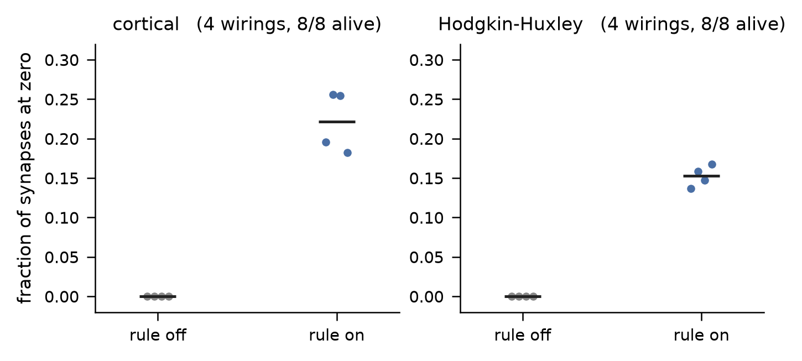
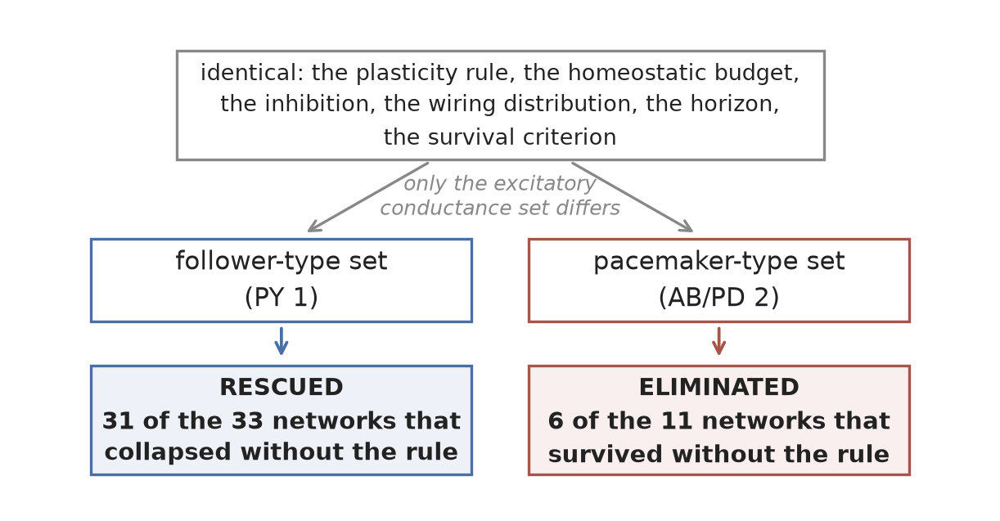
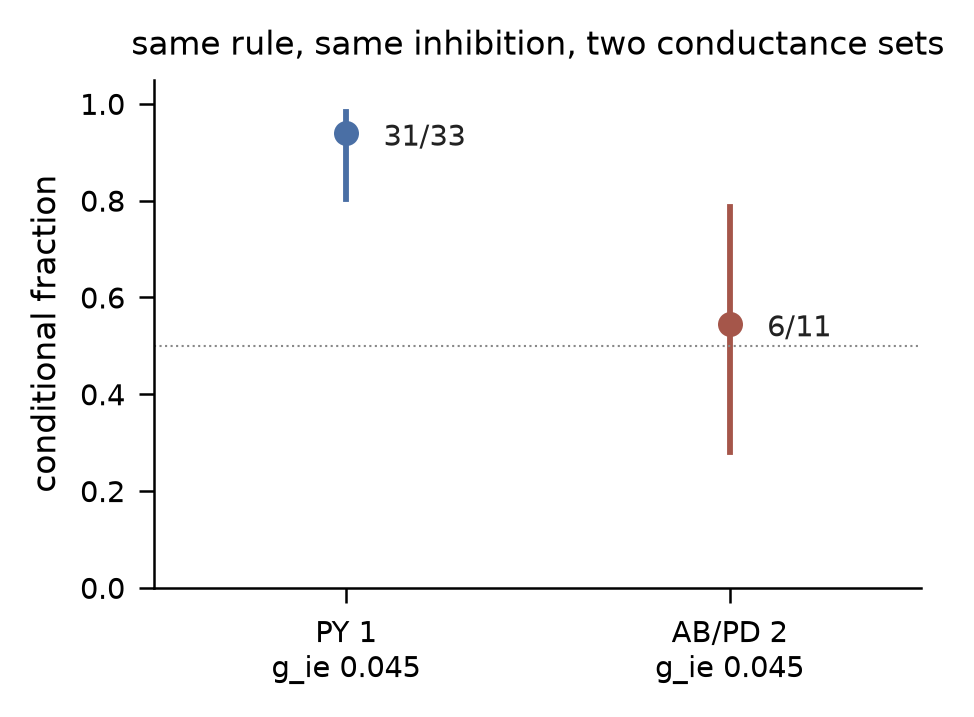
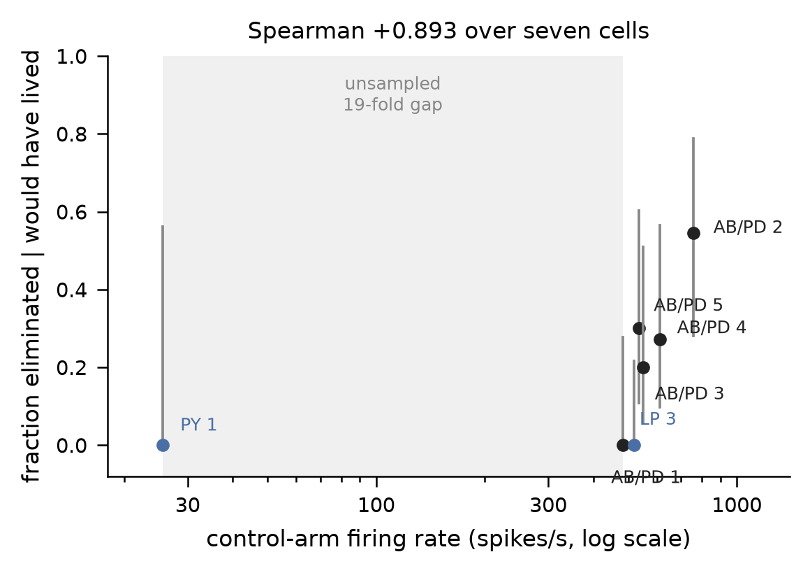
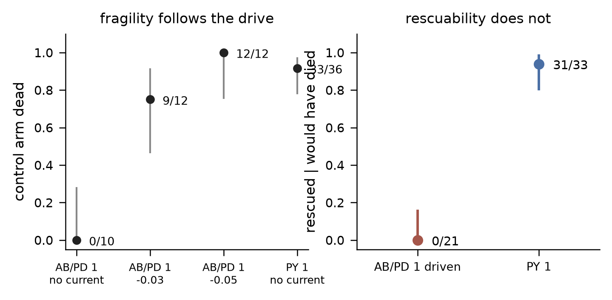
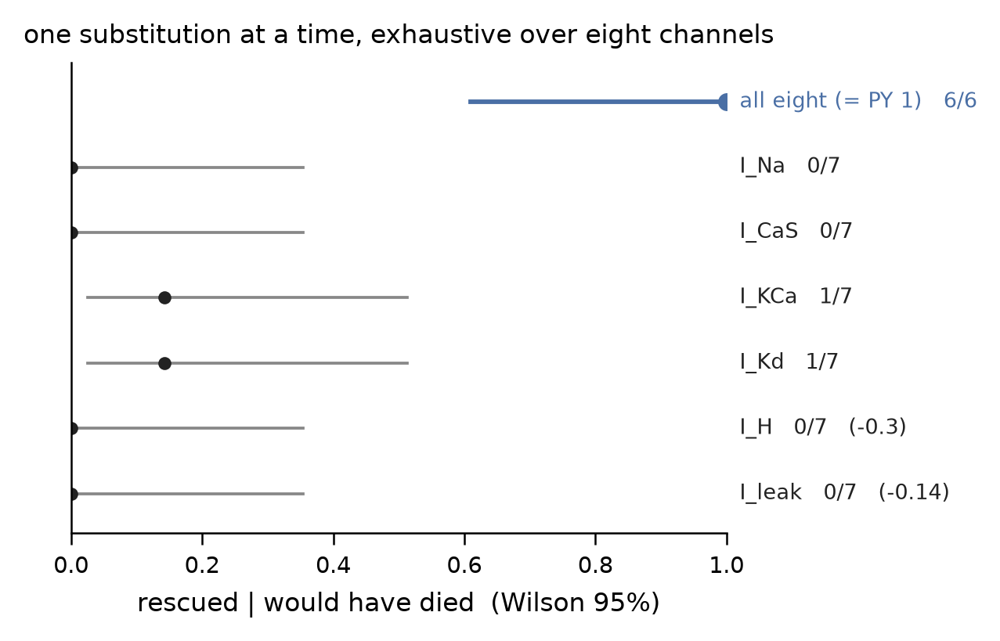

# The same plasticity rule rescues networks built from one conductance set and destabilises networks built from another

*Running title:* The same plasticity rule rescues one model neuron and eliminates another

**Filippo Groppi**¹ (ORCID 0009-0003-7486-5728) and **Jessica Ferrari**¹˒²
(ORCID 0000-0003-1089-3730)

¹ Luviner, Parma, Italy
² Università di Parma, Parma, Italy

Corresponding author: Filippo Groppi, filippo.groppi@gmail.com (Luviner: info@luviner.com)

**Keywords:** synaptic plasticity; STDP; homeostasis; network survival;
conductance-based model; stomatogastric ganglion; preregistration

---

## Abstract

Whether synaptic plasticity stabilises or destabilises a recurrent circuit is
usually treated as a question about the rule. We find that in a
conductance-based model it is not answered by the rule alone.

The model is a simulated bursting culture: 48 excitatory and 12 inhibitory
stomatogastric-ganglion neurons, sparsely and recurrently connected. The
recurrent synapses carry pair-based spike-timing-dependent plasticity under a
fixed homeostatic budget on each cell's total incoming excitatory conductance.
We ran one net-depressing rule, at one inhibition level, on unselected random
wirings, with a survival criterion fixed before the runs.

Two excitatory populations built from different published conductance sets
gave **opposite outcomes**. In one, the network collapsed without the rule in
33 of 36 wirings and the rule rescued **31 of those 33**. In the other, the
network survived without the rule in 11 of 12 wirings and the rule
**eliminated 6 of those 11**. The only model parameter changed between the two
is the excitatory conductance set, and that change also alters their intrinsic
dynamics.

We then asked what carries the reversal. Across seven conductance sets,
elimination increases with a cell's own firing rate, and cell identity does
not predict it — a follower-type cell firing at pacemaker rates behaves like a
pacemaker. But moving the firing rate inside a single set by injected current
reverses the same quantity, which rules out firing rate as a sufficient
explanation. Substituting one conductance at a time from the rescued set into
the other, over the six channels that differ, no single substitution
transferred the rescue (2 of 42 pooled) while substituting all eight did so in
6 of 6 (Fisher exact p = 2.3 × 10−6). **The sign reversal cannot be
attributed to any single tested conductance, and firing rate alone cannot
account for it.**

All results are computational and concern one circuit model, one plasticity
rule and one homeostatic constraint. Predictions and falsifiers were committed
to a version-controlled record before the corresponding runs, with three
departures from that order recorded in §9.

## 1. Introduction

A large literature asks whether activity-dependent synaptic plasticity
stabilises recurrent circuits or drives them to pathology, and answers are
usually framed as properties of the rule alone: additive spike-timing-dependent
plasticity with hard bounds is unstable and multiplicative forms are stable
(Song, Miller & Abbott, 2000; van Rossum, Bi & Turrigiano, 2000; Morrison,
Diesmann & Gerstner, 2008), and homeostatic terms restore stability provided
they act fast enough — a constraint Zenke & Gerstner (2017) show is severe,
because measured synaptic scaling is orders of magnitude slower than the
Hebbian instability it must contain. The implicit unit of analysis is the
rule, sometimes the network, rarely the neuron.

The homeostatic constraint used here is an idealisation of synaptic scaling
(Turrigiano et al., 1998; Turrigiano, 2008): the total incoming excitatory
conductance per cell is held to a fixed budget, instantaneously rather than
over hours. That makes the budget a strong and biologically fast version of
scaling, which is the regime in which the rule's effect is most constrained
and, as it turns out, most cell-dependent.

If stability is not a property of the rule alone, testing that requires a
model whose intrinsic conductances are catalogued and separately
manipulable. The stomatogastric tradition provides one.

Model neurons in that tradition make a different unit available.
Prinz, Bucher & Marder (2004) catalogued conductance sets that produce
pyloric-like activity, and the same catalogue contains cells whose intrinsic
firing rates differ by more than an order of magnitude at the same synaptic
drive. If the outcome of a plasticity rule depends on the cell it runs on,
this catalogue is the place it would show.

We ran one rule — pair-based, net-depressing, under a fixed homeostatic budget
on total incoming excitatory conductance — on populations built from seven of
those conductance sets, at one inhibition level, on unselected random wirings,
with a survival criterion fixed in advance. The question was not whether the
rule is stabilising. It was whether that question has a single answer inside
one circuit. It does not: in this model **the effect of a plasticity rule is
not determined by the rule alone, but depends on intrinsic cellular
properties.**

Two features of the design are worth stating before the results. First, every
prediction, falsifier and stopping rule was committed to a version-controlled
record before the corresponding run, and the index in §9 gives the
registration commit and the report commit for each result; §8 lists every
prediction that failed, including all of ours. Second, the quantities are
conditional probabilities on a 2 × 2 table, and the two conditionals have
denominators that trade off against each other: the fraction of dying networks
that the rule rescues can only be measured where the control dies, and the
fraction of surviving networks that it eliminates only where the control
lives. This is not merely a statistical complication: it follows directly from
the 2 × 2 structure of the outcome, and it governs which cell can answer which
question.

---

## 2. Results

### 2.1 The rule redistributes conductance rather than removing it

Under the homeostatic budget the rule does not reduce total recurrent
excitation; it concentrates it. On cells driven above rheobase, where firing
does not depend on the recurrent connections at all, between a fifth and a
quarter of the synapses are driven to zero — **22% on the cortical model**
(per-wiring range 0.18–0.26) and **15% on the Hodgkin–Huxley model**
(0.14–0.17) — while the population total falls **2.15%** and **10.15%** below
its budget respectively, and **no network dies on either arm: 0 of 4 wirings
on each of the two cell models**.
The much smaller deficits recorded elsewhere in this programme (−1.4% and
−0.6%) belong to the STG cells of a different row and are not these.

That is the boundary case that locates the effects below: where activity does
not need the recurrence, redistributing it changes nothing we measured.

**Figure 2.** Fraction of recurrent excitatory synapses driven to zero after
60 s, with the rule off and with it on, for two cell models driven above
rheobase (four wirings each; points are wirings, bars are arm means). The
total incoming conductance is held to a fixed budget throughout, so the
movement to zero is redistribution and not removal. All eight networks survive
in both arms. Source values in `figures/fig2_redistribution.csv`.

### 2.2 The same rule has opposite effects on two conductance sets

Two excitatory populations, identical in every respect except the published
conductance set they are built from, at the same inhibitory conductance
g_ie = 0.045, on unselected random wirings, with survival defined in advance
as at least 24 of 48 excitatory cells firing in the final 10 s of a 35 s run.

**On PY 1**, a follower-type set, the control arm collapses in 33 of 36
wirings, and with the rule running:

|            | rule on, alive | rule on, dead |
|------------|---:|---:|
| **rule off, alive** | 3 | 0 |
| **rule off, dead**  | **31** | 2 |

**P(alive with the rule │ dead without it) = 31/33 = 0.939**, Wilson 95% CI
**[0.804, 0.983]**, **p = 6.5 × 10−8**. Of the three wirings that would have survived anyway, the rule
eliminates none.

**On AB/PD 2**, a pacemaker-type set at the same inhibition, the control arm
survives in 11 of 12 wirings and the rule **eliminates 6 of those 11**
(0.545, Wilson [0.280, 0.787]) while rescuing the single wiring that died
. At g_ie = 0.060 it
eliminates 4 of 11; at g_ie = 0.030 nothing dies on either arm and the table
is empty, which shows the effect needs something to act on.

The inhibition, the rule, the budget, the wiring distribution, the horizon and
the detector are identical between the two. **The only model parameter changed
between these two populations is the excitatory conductance set, and that
change also changes their intrinsic dynamics** — they differ by more than an
order of magnitude in firing rate at the same synaptic drive, which is the
subject of §2.3 and the caveat on reading §2.2 as an isolated comparison.

**Both cells were measured under two detectors.** The registered one asks
whether a cell fired at any point in the final 10 s; a stricter variant
requires the quorum in the final 5 s alone. **On both cells, at 35 s, the two
detectors agree on every wiring.**

**Figure 1.** The design and its result in one view. Everything above the
split is identical between the two populations — the plasticity rule, the
homeostatic budget, the inhibitory conductance, the wiring distribution, the
simulation horizon and the survival criterion — and the only model parameter
that differs is the excitatory conductance set, which also changes the
populations' intrinsic dynamics. The outcome inverts: the rule rescues most of
the networks that collapse without it in one population and eliminates the
majority of those that survive without it in the other. Numbers are read from
the recorded runs; source values in `figures/fig1_concept.csv`.

**Figure 3.** The two conditional outcomes with Wilson 95% intervals: for
PY 1, the fraction of networks that collapsed without the rule and survived
with it; for AB/PD 2, the fraction that survived without the rule and were
eliminated by it. Same inhibition, same rule, same wiring distribution; the
conductance set is the only difference. The dotted line marks 0.5. Source
values, including the g_ie 0.030 and 0.060 tables, in
`figures/fig3_two_signs.csv`.

### 2.3 Elimination increases with firing rate across the sampled conductance sets

Seven conductance sets at g_ie = 0.045, each contributing its own control-arm
firing rate measured in the same runs, all at a 35 s horizon. The comparable
statistic across cells is the fraction of surviving wirings the rule
eliminates: unlike (rescued − eliminated), it has no ceiling set by the
control's mortality, which is itself the ordering variable.

| cell | spikes/s | n | eliminated │ would have survived |
|---|---:|---:|---:|
| PY 1 | 25.6 | 36 | 0.000 |
| AB/PD 1 | 482.7 | 10 | 0.000 |
| LP 3 | 517.7 | 14 | 0.000 |
| AB/PD 5 | 536.2 | 10 | 0.300 |
| AB/PD 3 | 549.9 | 10 | 0.200 |
| AB/PD 4 | 610.8 | 14 | 0.273 |
| AB/PD 2 | 756.2 | 12 | 0.545 |

**Spearman +0.852, p = 0.0286**
. Within the seven sets
sampled here, elimination increases monotonically with intrinsic firing rate.

**Cell identity does not predict it.** LP 3 is a follower cell, like PY 1, and
was named in the registration as the case that would separate a firing-rate
account from an identity account, because it fires at 517.7 spikes/s — next to
the pacemakers and nowhere near PY 1's 25.6. It behaves like the pacemakers at
that rate: 0.000 eliminated, identical to AB/PD 1, and nothing like PY 1.

Two limits belong with this number. **The relationship is carried by the low
end**: excluding PY 1 leaves Spearman +0.812 at p = 0.072 over six cells, and
PY 1 sits at 25.6 spikes/s with the next cell at 482.7, a nineteenfold gap that
the sampled catalogue does not fill. And **AB/PD 2's own elimination excess is
not individually significant** — 6 eliminated against 1 rescued is seven
discordant wirings, p = 0.125 — so the cell at the high end
supports the relationship as a point estimate and not as a test.

**Figure 4.** Fraction of surviving networks eliminated by the rule, against
the control arm's own firing rate, for seven conductance sets on a logarithmic
axis; bars are exact Wilson 95% intervals and the shaded band is the
unsampled interval between the slowest set and the next. The two follower-type
sets are labelled in colour: one is the slowest cell and one fires at
pacemaker rates. All seven were measured at the same 35 s horizon. Source
values in `figures/fig4_ordering.csv`.

### 2.4 Changing the firing rate within one cell reverses the effect

The relationship in §2.3 is across conductance sets, and it does not survive a
manipulation inside one. Injecting a constant hyperpolarising current into the
excitatory population of AB/PD 1 — the same conductance set, the same wirings,
only the drive moved — takes the elimination fraction from **0.000 at its
natural rate of 483 spikes/s to 1.000 at the driven setting**, where the rule
eliminated all three wirings that would otherwise have survived.

Across cells, elimination rises with rate. Within this cell, it rises as the
rate falls. A cross-cell association is not a within-cell causal manipulation,
and here the two disagree: **the manipulation falsifies firing rate as a
sufficient explanatory variable for the effect.** §2.3 records an association
across the sampled sets; it does not license a causal reading in terms of
rate.

### 2.5 Fragility and rescuability dissociate

The same manipulation separates two things that §2.3 conflated, because the
only rescued cell there is also the only slow one.

| condition | control-arm rate | control dead | rescued |
|---|---:|---:|---:|
| AB/PD 1, no injected current | ~483 spikes/s | 0/10 | — |
| AB/PD 1, −0.03 µA/cm² | — | 9/12 | 0/9 |
| AB/PD 1, −0.05 µA/cm² | 132 (first 5 s) | 12/12 | 0/12 |
| PY 1, no injected current | 25.6 spikes/s | 33/36 | **31/33** |

**Fragility follows the rate within one fixed cell**: 0 of 10 controls collapse at
baseline and 12 of 12 at the driven setting. **Rescuability does not.** At
matched fragility the rule rescues PY 1 in 31 of 33 opportunities and the
driven cell in **0 of 21** (**p = 4.9 × 10−13**).

**Slow firing predicts fragility, but not rescue.**

**The state of the driven preparation limits this comparison.**
The 132 spikes/s above is measured over the first 5 s, before any collapse;
over the whole run the driven preparation averages **19 spikes/s and produces
zero network bursts**. It is therefore matched to the follower cell on
**control mortality and not on dynamical state** — it has left the bursting
regime, and the follower has not. What the comparison licenses is that
equalising how often the control dies does not equalise rescuability; it does
not license the stronger reading that two otherwise equivalent preparations
differ only in conductances.

**Figure 5.** Left: the fraction of control networks that collapse, for
AB/PD 1 at its natural drive and under two injected currents, and for PY 1;
the drive manipulation moves one conductance set from never collapsing to
always collapsing. Right: the fraction of collapsing networks that the rule
rescues, for the driven cell and the follower, at matched control mortality.
Bars are Wilson 95% intervals. Source values in
`figures/fig5_fragility_vs_rescue.csv`.

A control registered after the primary analysis, because the primary analysis
was circular: the per-wiring rate first used to relate rate to death was
averaged over the whole run, and a wiring that dies has a low average because
it died. Re-running the control arm for 5 s — the same deterministic opening,
before any death — gives a rate that cannot depend on survival, and the three
wirings that survived are exactly the three with the highest early rates
(complete rank separation; exact one-sided p = 1/C(12,3) = 0.0045).

### 2.6 No single tested conductance substitution transfers the rescue

We substituted PY 1's value for AB/PD 1's, one channel at a time, exhaustively
over the eight conductances of the model, at a drive re-chosen per arm so that
each arm's own control dies. Two of the eight conductances are identical
in the two cells (I_CaT and I_A), so six substitutions are informative; one of
the identical pair is retained as a gate and reproduces the unsubstituted cell
bit for bit.

The positive control is the complete substitution, which is PY 1 by
construction and is run at the same drive, wirings and horizon as the single
substitutions.

| substitution | drive (µA/cm²) | control dead | rescued | Fisher vs 0/21 |
|---|---:|---:|---:|---:|
| **all eight (= PY 1)** | −0.03 | 6/7 | **6/6** | **< 10−4** |
| I_Na, fast sodium | −0.03 | 7/7 | 0/7 | 1.000 |
| I_CaS, slow calcium | −0.03 | 7/7 | 0/7 | 1.000 |
| I_KCa, calcium-activated potassium | −0.03 | 7/7 | 1/7 | 0.250 |
| I_Kd, delayed-rectifier potassium | −0.03 | 7/7 | 1/7 | 0.250 |
| I_H, hyperpolarisation-activated inward | −0.30 | 7/7 | 0/7 | 1.000 |
| I_leak, leak | −0.14 | 7/7 | 0/7 | 1.000 |

**Six single substitutions pooled rescue 2 of 42; the complete substitution
rescues 6 of 6; p = 2.3 × 10−6.** The complete
substitution's own control rate is 32 spikes/s, and **two** single
substitutions are rate-matched to it: I_Na at 23 and I_KCa at 27 spikes/s,
both with 7 of 7 controls dead. Comparing the complete substitution against
those two directly gives **p = 0.0006 and p = 0.005**. The other four are not
rate-matched (1, 75, 18 and 16 spikes/s) and their comparisons are not offered
as matched ones.

**We do not identify a mechanism, and we state the result as an absence.**
The decomposition is exhaustive over single substitutions and empty:
**no single tested conductance substitution was sufficient to transfer the
rescue phenotype.** Whether any is *necessary* is a different question, addressed by the complementary design (substitute
all eight, then restore one at a time) and not by this one.

**Figure 6.** Fraction of collapsing networks rescued by the rule, for the
complete eight-channel substitution and for each informative single
substitution, with Wilson 95% intervals; seven wirings per arm and each arm at
a drive chosen so that its own control collapses, printed where it differs
from the common one. The two channels identical in both conductance sets are
used as gates and are not plotted. Source values in
`figures/fig6_decomposition.csv`.

## 3. Discussion

*In short: within one simulated circuit, the same plasticity rule has opposite
effects on two conductance sets; firing rate orders the destructive direction
across the sampled sets but is falsified as a sufficient explanation within
one; and no single conductance substitution transfers the protective one. We
identify no mechanism, and make no claim beyond this model.*

In this model the outcome of a plasticity rule is not determined by the rule
alone, but depends on intrinsic cellular properties. The same net-depressing
pair rule, the same homeostatic budget and the same inhibition rescue almost
every collapsing network built from one published conductance set and
eliminate the majority of surviving networks built from another. Both signs are present inside one circuit model at one parameter
setting.

The two signs do not share a cause. Within the seven conductance sets sampled
here, elimination increased monotonically with intrinsic firing rate — but the
same quantity **reverses** when the rate is moved inside a single set by
injected current. **This is an ordering phenomenon across the sampled sets,
not a rate law**: firing rate is a correlate across this sample and not a
cause of elimination. Rescue does not track rate at all: driving a set until
its control arm collapses as often as the follower's does not make it rescuable,
and substituting the follower's conductances one at a time does not transfer
the property. **Slow firing predicts fragility, but not rescue.**

The implications for the stabilising/destabilising literature are bounded by
this model: **it is a simulation result about one circuit, and in that circuit
the question does not have a single answer.**
In this model a rule that is destabilising on one conductance set is protective
on another that differs only in intrinsic conductances. Whether that carries
to other models, other rules or living tissue is not addressed here.

The negative result of §2.6 is worth as much as the positive ones. It is common to expect that a network-level outcome traced to a
cell's intrinsic properties will localise to a channel, and here it does not
at the resolution tested: the exhaustive
single-substitution decomposition is empty at a resolution that detects the
complete substitution at p = 2.3 × 10−6. We report this as an absence at a
stated resolution, not as evidence that no such decomposition exists.

---

## 4. Limitations

1. **Everything here is computational.** No claim is made about living tissue.
   The preparation is a model culture built from published conductance sets;
   its wirings are realisations of one model, not independent biological
   preparations.
2. **One rule, one budget, one inhibition level for the main comparisons.**
   Initialisation and network size were tested and are reported in §6;
   **inhibition, the rule itself and the budget were not varied**, and nothing
   here establishes that the two signs survive changes to them.
3. **The relationship in §2.3 is carried by its low-rate end.** Excluding PY 1
   it does not reach p < 0.05 at six cells, and the interval between 25.6 and
   483 spikes/s contains no cell in the sampled catalogue.
4. **AB/PD 2's elimination excess is not individually significant** (exact
   p = 0.125). It contributes a point estimate to §2.3, not a test.
5. **§2.3 is a correlation across a sample of seven, and §2.4 shows it
   reverses within a cell.** It supports no causal statement about firing rate.
6. **Four of the six single substitutions in §2.6 produced no measurable
   change in firing rate or bursting with the rule on.** Their nulls may
   reflect a preparation beyond the rule's reach at that drive rather than a
   conductance that fails to confer rescue. We deliberately do not stratify
   the analysis on this: whether the rule "acted" is measured in the same arm
   as the rescue, and a rescued network fires more, so the split would be
   circular. It is a limit on the interpretation.
7. **The drives in §2.5 and §2.6 are not matched across arms.** I_H and I_leak
   required currents five to ten times further from baseline before their
   controls died, and the response of firing rate to injected current is not
   monotone in these substituted cells, so their qualifying drives were found
   by search rather than by ramp.
8. **The survival detector is a quorum on a fixed window**, and its horizon
   changes borderline classifications: two of 48 wirings reclassify between
   30 s and 35 s. All results above are reported at 35 s, and on both cells at
   that horizon the registered and strict detectors agree on every wiring.
9. **The rank correlation treats each conductance set as one observation.**
   Per-cell denominators run from 3 to 36 wirings and are weighted equally;
   PY 1's own elimination estimate is **0 of 3**, Wilson [0.000, 0.562]. Exact
   per-cell intervals are given in §2.3 and Figure 3, and the correlation is
   **not robust to precision weighting**, which we do not apply and do not
   claim.
10. **Multiple comparisons.** Eight arms were tested in §2.6 against a common
   baseline; the p-values reported are uncorrected, and a Bonferroni
   family-wise threshold at six informative arms is **0.0083**. The complete
   substitution (p < 10−4, and 2.3 × 10−6 pooled) clears it; no single
   substitution approaches it. The rate-matched pairwise comparisons in §2.6
   were **chosen after seeing the control rates** and are reported as
   descriptive.
11. **The decomposition tests cardinality one and cardinality eight only.**
   Nothing between was run, so §2.6 establishes that no single conductance is
   sufficient and places an **upper bound of eight** on the size of a
   sufficient combination. It says nothing about two, three or seven.
12. **Each arm in §2.6 has n = 7 wirings.** The design is powered to detect a
   rescue against a zero baseline, not to estimate a small rescue rate.
13. **The phenomenon requires the network size reported here.** At 24
   excitatory cells instead of 48, the follower-type population fires about
   four times faster and its control arm does not collapse, in either
   initialisation family, so there is no rescue to measure (§6). Everything in
   §2.2 and §2.5 is conditional on the larger network.
14. **The intrinsic conductances are fixed, and in real cultured neurons they
   are not.** Turrigiano, Abbott & Marder (1994) showed that cultured
   stomatogastric neurons change their intrinsic current densities in response
   to their own activity, on a timescale of days. Every result above treats a
   conductance vector as a constant property of a cell, so a real preparation
   would not necessarily stay at one point of §2.3 while the plasticity rule
   acted on it. This is a limitation of the model, not of the analysis, and it
   bears directly on the experiment proposed in §5.

## 5. A testable prediction, and what would retire the finding

The model predicts that in a preparation where population activity depends on
recurrent excitation, a net-depressing plasticity rule under a conserved total
conductance should have **opposite effects on survival in populations whose
intrinsic firing rates differ by an order of magnitude at matched synaptic
drive** — protective in the slow population, destructive in the fast one.

**We are not proposing that experiment yet.** The programme's own gate order
puts a robustness test (§6) before any biological test, and that test has not
run. What the model licenses today is the shape of the eventual experiment,
recorded so that it is on the record before the enabling result rather than
after: a preparation in which intrinsic excitability can be shifted
pharmacologically or optogenetically within the same culture, with network
survival scored under a fixed criterion and a plasticity manipulation applied
in both states. Which preparation, and whether the model's regime is
reachable in it, is not settled here.

**The falsifier we would accept:** in a preparation where the slow and fast
conditions are produced within the same culture and the plasticity
manipulation is identical, an effect of the same sign in both conditions
retires the claim. So does the registered robustness test in §6 returning a
sign change under a different initialisation or network size.

---

## 6. Robustness to initialisation and network size

The registered robustness test has now run. It asked whether the two-sign
result of §2.2 survives changes of initialisation and network size: the same
two conductance sets at matched fragility, across two initialisation families
and two network sizes, at one inhibition level. Its falsifier, registered
before the runs, was **a condition in which the two rescue rates cross**.

Family A is the initialisation used throughout this study — Gaussian jitter of
20% about the budget mean. Family B draws each initial weight uniformly on
[0, 2·w̄], the same mean and roughly three times the spread, so the homeostatic
budget starts identical.

| condition | follower-type rescue | pacemaker-type rescue | crossing |
|---|---:|---:|---|
| family A, 48 excitatory cells | 9/10 = 0.900 | 0/10 | **no**, p = 1.2 × 10−4 |
| family B, 48 excitatory cells | 9/9 = 1.000 | 0/10 | **no**, p = 1.1 × 10−5 |
| family A, 24 excitatory cells | — | 0/10 | **not testable** |
| family B, 24 excitatory cells | — | 0/10 | **not testable** |

**The falsifier did not fire in either condition where it could be tested**,
and the initialisation family moves little: the control arm collapses in 10 of
11 and 9 of 11 wirings and the rule rescues 0.900 and 1.000.

**Two conditions could not be tested, and the reason is a limitation of the
study rather than a null result.** At half the network size the follower-type
population fires roughly four times faster — 105 and 100 spikes/s against 26
and 39 — and **its control arm does not collapse at all, in either
initialisation family (0 of 11)**. With no collapse there is nothing to
rescue and the conditional is undefined. The pacemaker-type set still collapses
10 of 10 at both sizes and is still rescued 0 of 10, so the loss is specific to
the cell on which §2.2's headline is measured.

**The collapse this study measures rescue against is therefore
size-dependent**, and the result should be read as robust to initialisation at
the size reported and as not occurring at half that size. That is a weaker
statement than a sign reversal, and it is a different one: the phenomenon does
not invert, it ceases to have an occasion.

## 7. Preregistration deviations, corrections, and audit trail

The protocol commits every prediction and falsifier before the corresponding
run. More predictions failed than held; this section gives the rate and the
failures that changed what the paper claims, and **the full table, prediction
by prediction, is Supplementary Note S1**.

### 7.1 Predictions that failed

Nine of our registered predictions were refuted or proved unmeasurable, and
three of the orchestrating record's were refuted. Two of ours were registered
*against* earlier predictions of ours after the evidence moved, and those two
held. Three failures changed the manuscript rather than merely being recorded:

- **The mechanistic prediction was wrong twice.** We predicted that I_H, the
  rebound conductance, carried the rescue, on the argument that a rescue
  requires a cell able to fire from strong transient input; at a drive where
  its control collapsed it transferred nothing (0 of 7). Our second choice,
  I_KCa, reached 1 of 7. The orchestrating record's prediction — a
  burst-duration conductance — also failed. §2.6 is what is left when all
  three mechanistic guesses fail.
- **A prediction about time that was simply lazy.** We predicted the
  pacemaker's elimination fraction would rise at the longer horizon, reasoning
  that five more seconds is more time to collapse. It did not move at all
  (6 of 11 at both horizons): on that cell the control arm's classification is
  horizon-invariant.
- **The horizon itself was a departure.** Two cells were first measured at a
  shorter horizon than the other five. That was found during revision, not
  registered in advance, and closed by re-measuring both at the common horizon
  with the consequence for this abstract of each outcome written before the
  run. The relationship in §2.3 was unchanged; the rescue conditional moved
  from 33/33 to 31/33, and the sentence it had supported — that not one
  network which collapsed without the rule collapsed with it — is no longer
  true and has been removed.

### 7.2 Design defects found and corrected, with what they cost

- **A statistic whose ceiling moves with the ordering variable.** (rescued −
  eliminated) cannot exceed the control's death rate, which is what the
  ordering variable drives. Found after COLL-8 ran; the elimination fraction,
  which has no such ceiling, is reported as primary and orders the cells more
  strongly.
- **A circular covariate.** The per-wiring rate used to relate rate to death in
  COLL-9 was averaged over a window containing the death. The registered
  repair re-measures it over the deterministic first 5 s.
- **Two unreachable thresholds.** A falsifier set at "≥ 3 wirings dead in both
  arms" fires with probability 0.928 when the hypothesis it tests is true; its
  proposed replacement, a Wilson lower bound of 0.8, is unreachable at any
  feasible sample size (0.711 even at n = 100). Both were replaced with an
  exact test against p ≤ 0.5 before the run.
- **A minimum-denominator rule, registered in advance**, prevented an arm
  scoring 1 of 1 at p = 0.0455 from being reported as a finding. At a proper
  denominator that arm is 0 of 7.
- **A power calculation fed by the pilot that motivated it.** A sample-size
  estimate used a standard deviation from three seeds; at six seeds it fell by
  a third and the conclusion changed.
- **A rank correlation computed on ranks that did not handle ties.** Three
  of the seven cells in §2.3 tie at an elimination fraction of 0.000, and the
  rank function used broke those ties by input order — which, because the tied
  cells are the three slowest, is the tie-breaking most favourable to the
  hypothesis. On ranks with ties averaged, the standard definition, rho is
  **+0.852** rather than +0.893 and the six-cell value **+0.812** rather than
  +0.829. The quoted p = 0.0123 could not be reproduced under any tie
  convention or sidedness and has been replaced by the two-sided permutation p,
  0.0286. **The inference is unchanged**: the seven-cell relationship is still
  significant at 0.05, the six-cell one still is not, and §2.3's two stated
  limits stand. Found by STATS-1, which recomputes every statistic from the
  deposited runs; the figure and the figure checker were corrected with it.
- **Two p-values quoted from the one-sided tail while the rest were
  two-sided.** Found by recomputing every Fisher p in this manuscript from the
  deposited counts under both conventions. Only two of nine differed: §2.6's
  I_KCa comparison (0.004 → 0.005) and §6's family A (6.0 × 10−5 →
  1.2 × 10−4). All are now two-sided, the convention is stated in
  Methods, and neither correction changes an inference.

### 7.3 A recorded discrepancy with the closest prior work

The work closest to ours is Jacquerie, Tyulmankov, Sacré & Drion, *Burst
firing creates an attractor in synaptic weight dynamics* (PLOS Computational
Biology 2026; our internal record cites it as 2025). For pair-based STDP in a
feedforward network without homeostasis, they derive that bursting drives
weights into a narrow attractor. In this preparation, measured at 50 ms
resolution across five wirings and 60 s each, the coefficient of variation of
recurrent excitatory weights **rises from 0.202 to 1.357** over 35 stored
runs; it **grows inside every single burst — 214 of 214 — at +0.097 s−1**, and
contracts only *between* bursts, where the homeostatic renormalisation acts,
at **−0.013 s−1**, roughly seven times weaker, so the sign is inverted on
both legs. **We did not observe the attractor-like convergence they describe**,
under the present recurrent and homeostatically constrained conditions; **the
tonic-firing control their result makes necessary was not run**, so this is a
discrepancy we report and not a refutation we claim.

**Same substrate, opposite sign.** We attribute the difference to the
homeostatic budget and the recurrence, neither of which is in their
derivation — but that attribution is an inference and not a measurement,
because the tonic control arm their result makes obligatory **has not been
run**. This discrepancy was recorded in our own literature review before this
manuscript was drafted and is reported here because a failure list that omits
it is not a failure list.

### 7.4 Results withdrawn

- A hysteresis signature reported on one ramp rate did not survive a slower
  ramp: the gap fell from 2.6× to 1.16× the noise and the feature moved one
  step along the parameter ladder, which identifies it as a lag rather than a
  coexistence. **No hysteresis claim is made in this manuscript.**
- An earlier generalisation from a single cell model to "self-generating
  networks" was withdrawn twice and is not used.

### 7.5 Execution record

Runs were interrupted three times by the machine rather than by the protocol:
by repeated sleeps on battery, by the stopping rule, and by a low-memory
event. **No data was lost in any of them**, because each lot is written to
disk before its clock check. The execution environment was rebuilt once,
mid-row, after a filesystem cleanup emptied it; a completed lot was then
re-run and compared field by field against the stored version — **72
comparisons, 0 differences** — before any new numbers were accepted.

Per-run timings, the wall-versus-process-time divergences, the environment
rebuild and its verification, and the batched-versus-unbatched acceptance
gates are in **Supplementary Note S1** rather than here.

## 8. Methods

### 8.1 Shared with the companion manuscript

The neuron model, the simulated culture, the plasticity rule and the
homeostatic budget are those of the companion preprint (Groppi & Ferrari,
2026; reference 17), and are summarised here only far enough to read the
results. Each cell is the single-compartment STG model of
Prinz, Billimoria & Marder (2003): eight Hodgkin–Huxley-type currents (I_Na,
I_CaT, I_CaS, I_A, I_KCa, I_Kd, I_H, I_leak), an intracellular calcium pool
(τ_Ca = 200 ms), and E_Ca recomputed each step from the Nernst equation with
[Ca]_ext = 3 mM at 283 K. The gating kinetics are the voltage-clamp
measurements of Turrigiano, LeMasson & Marder (1995) as formulated by Liu,
Golowasch, Marder & Abbott (1998) and tabulated in Prinz et al. (2003,
Table 1); the graded baseline synapses follow Prinz, Bucher & Marder (2004)
after Abbott & Marder (1998). The dish is 48 excitatory and 12 inhibitory neurons,
plastic excitatory→excitatory connections at probability 0.15, total incoming
conductance budget fixed at (N−1)·p·w̄ with w̄ = 0.015, short-term depression
(release fraction 0.20, recovery τ = 400 ms), and pair-based additive STDP with
hard bounds w ∈ [0, 0.06], A₊ = 0.012, τ₊ = 16.8 ms, τ₋ = 33.7 ms — the time
constants measured by Bi & Poo (1998) — and A₋ set from the area-ratio
constraint so that the rule is net-depressing.

### 8.2 What is specific to this study

**Validation of the preparation.** The conductance sets are taken from a
published database (Prinz, Bucher & Marder, 2004) and the circuit follows the
STG modelling tradition (Abbott & Marder, 1998), but **this manuscript
contains no independent validation that the simulated preparation reproduces a
measured biological target.** Animal-to-animal variability in the real
preparation is characterised by Bucher, Prinz & Marder (2005), and the
degeneracy that motivates using a set of conductance vectors rather than one
is the subject of Marder & Goaillard (2006). Neither comparison is made here,
and the absence is a limitation of this study rather than of those sources.

**Conductance sets.** Excitatory populations are built from Prinz, Bucher &
Marder (2004) Table 2 sets: AB/PD 1–5, LP 3 and PY 1. The inhibitory
population is the LP 3 set throughout, including in the row where LP 3 is also
the excitatory set; that row's excitatory and inhibitory cells are therefore
identical, which is stated in its registration and does not change its result.

**Survival criterion and horizon.** A network is alive if at least 24 of the 48
excitatory cells emit at least one spike in the final 10 s of the run. **Every
result reported above is at a 35 s horizon.** Two cells were first measured at
30 s and re-measured at 35 s once the horizon was found to reclassify
borderline wirings; the 30 s values survive here only in Limitation 8, which
records that two of 48 wirings change classification between the horizons and
that at 35 s the registered and strict detectors agree on every wiring of both
cells. A stricter variant
requiring the same quorum in the final 5 s alone is reported wherever the two
differ.

**Arms and wirings.** Each cell contributes a rule-on and a rule-off arm on the
*same* random wirings, so the 2 × 2 table is paired. Wirings are drawn from
consecutive integer seeds and are not selected on any outcome.

**Injected current.** Where the drive is manipulated, a constant current is
added to the excitatory population only, through the simulator's existing
external-current input; the inhibitory population is untouched. The
current-to-rate relation is not monotone in the substituted cells of §2.6 and
qualifying drives were found by search, with the search reported in the
registration.

**Validation of the simulation infrastructure.** Runs are batched across
wirings for speed, and the batched implementation is required to reproduce the
unbatched one **bit for bit** — identical spike times and identical weights,
not agreement to a tolerance — on both arms, at the cell and inhibition of the
run in question. **This gate is re-run per cell rather than inherited, and
passed at 0.000 × 10⁰ in every instance reported here**, including for the
external-current parameter used in §2.4–§2.6, which no earlier row had
exercised. Where a conductance substitution is expected to change nothing
(the two channels identical in both cells) the substituted cell is likewise
required to reproduce the unsubstituted one bit for bit, which is what
establishes that the substitution machinery perturbs nothing by itself. These
gates validate the implementation; they say nothing about whether the
preparation matches biology, on which see above.

**Statistics.** Conditional probabilities carry Wilson 95% intervals, and
every p-value quoted in the Results comes from the test named here for that
quantity. Tests are exact throughout: binomial against p ≤ 0.5 for a single conditional, two-sided Fisher for
2 × 2 comparisons, McNemar's exact form on discordant pairs where a sign is at
issue, and full-enumeration permutation for Spearman correlations (5,040
permutations at seven cells). Spearman's rho is computed on ranks with ties
averaged, and its permutation p is two-sided, as the Fisher and McNemar p are.
No asymptotic approximation is used, and no result rests on n < 3 in a
denominator.

---

## 9. Pre-registration index

Every result traces to a section committed before its numbers existed, and the
hashes below were verified against the repository when this manuscript was
written. **Three departures from a clean ordering are listed under the table
rather than smoothed over**, because an index that overstates itself is worth
less than one that does not.

| result | § | registration | report |
|---|---|---|---|
| redistribution on driven cells | 2.1 | `234901f` | `f19c5f7` |
| elimination rate with an interval | 2.3 | `016f409` | `be6b42e` |
| rescue conditional, first measurement | 2.2 | `033aecb`, gate `d28c56b` | `68ece31` |
| elimination with firing rate, five of the seven cells | 2.3 | `6d2a958` | `1bf9b3d` |
| both endpoints at 35 s — **§2.2 and §2.3 report this row** | 2.2, 2.3 | `97f1254` | `74280de` |
| robustness to initialisation and size | 6 | `8ac4db4` | `7e51296` |
| within-cell reversal | 2.4 | `6536bfd` | `d44e3f6` |
| fragility vs rescuability | 2.5 | `6536bfd`, control `cd835ce` | `d44e3f6` |
| decomposition, first half | 2.6 | `319f060` | `ad1f380` |
| decomposition, second half | 2.6 | inside `ad1f380` (see note i) | `59a7fc0` |
| decomposition, the two rate-raising channels | 2.6 | `60d8992` | `7ec5dd0` |

**(i) The decomposition's second half was registered inside a report commit.**
`ad1f380` carries both the partial report of the first half and the
registration of the second. Its registration content therefore precedes the
second half's numbers, which is what the protocol requires, but it does not
sit in a commit of its own and a reader checking "registration before report"
by commit order alone will see `ad1f380` and `59a7fc0` preceding `60d8992`.

**(ii) One analysis script first appears in a report commit.** For the
seven-cell ordering, `coll8b.py` and `analyse.py` are first committed in
`1bf9b3d`, the report. The design, the grid and the thresholds were registered
beforehand in `6d2a958`; the code was not.

**(iii) The horizon change was not registered as such when it happened.** It
followed from a detector limitation, and both endpoint cells were subsequently
re-measured at the common horizon in a row whose registration (`97f1254`)
states, before the run, what each possible outcome would do to this
manuscript's abstract. All figures above are at that single horizon.

---

## References

Formatted in PLOS Computational Biology style. Every entry has been checked
against the published record. Entries 1–17 are cited in the text; **entry 18 is listed only to disambiguate
entry 16**, because the two share authors and
year in our internal record and only one of them is the work §7.3 compares
against.

1. Prinz AA, Billimoria CP, Marder E. Alternative to hand-tuning
   conductance-based models: construction and analysis of databases of model
   neurons. J Neurophysiol. 2003;90(6):3998–4015.
2. Prinz AA, Bucher D, Marder E. Similar network activity from disparate
   circuit parameters. Nat Neurosci. 2004;7(12):1345–1352.
3. Bucher D, Prinz AA, Marder E. Animal-to-animal variability in motor pattern
   production in adults and during growth. J Neurosci. 2005;25(7):1611–1619.
4. Marder E, Goaillard J-M. Variability, compensation and homeostasis in
   neuron and network function. Nat Rev Neurosci. 2006;7(7):563–574.
5. Turrigiano GG, Leslie KR, Desai NS, Rutherford LC, Nelson SB.
   Activity-dependent scaling of quantal amplitude in neocortical neurons.
   Nature. 1998;391(6670):892–896.
6. Turrigiano GG. The self-tuning neuron: synaptic scaling of excitatory
   synapses. Cell. 2008;135(3):422–435.
7. Song S, Miller KD, Abbott LF. Competitive Hebbian learning through
   spike-timing-dependent synaptic plasticity. Nat Neurosci.
   2000;3(9):919–926.
8. van Rossum MCW, Bi GQ, Turrigiano GG. Stable Hebbian learning from
   spike timing-dependent plasticity. J Neurosci. 2000;20(23):8812–8821.
9. Bi GQ, Poo MM. Synaptic modifications in cultured hippocampal neurons:
   dependence on spike timing, synaptic strength, and postsynaptic cell type.
   J Neurosci. 1998;18(24):10464–10472.
10. Zenke F, Gerstner W. Hebbian plasticity requires compensatory processes on
    multiple timescales. Philos Trans R Soc Lond B Biol Sci.
    2017;372(1715):20160259.
11. Morrison A, Diesmann M, Gerstner W. Phenomenological models of synaptic
    plasticity based on spike timing. Biol Cybern. 2008;98(6):459–478.
12. Abbott LF, Marder E. Modeling small networks. In: Koch C, Segev I,
    editors. Methods in Neuronal Modeling: From Ions to Networks. 2nd ed.
    Cambridge (MA): MIT Press; 1998. p. 361–410.
13. Liu Z, Golowasch J, Marder E, Abbott LF. A model neuron with
    activity-dependent conductances regulated by multiple calcium sensors.
    J Neurosci. 1998;18(7):2309–2320.
14. Turrigiano G, Abbott LF, Marder E. Activity-dependent changes in the
    intrinsic properties of cultured neurons. Science. 1994;264(5161):974–977.
    doi:10.1126/science.8178157.
15. Turrigiano G, LeMasson G, Marder E. Selective regulation of current
    densities underlies spontaneous changes in the activity of cultured
    neurons. J Neurosci. 1995;15(5):3640–3652.
16. Jacquerie K, Tyulmankov D, Sacré P, Drion G. Burst firing creates an
    attractor in synaptic weight dynamics. PLOS Comput Biol. 2026.
    doi:10.1371/journal.pcbi.1014001. *This is the work §7.3 compares
    against; our internal record cites it as 2025.*
17. Groppi F, Ferrari J. Weak pre-before-post pair biases sort synaptic
    weights in a conductance-based model of spontaneous network bursting.
    bioRxiv. 2026. doi:10.64898/2026.09.03.749248. *The companion preprint;
    its §7 gives the neuron model, the culture, the plasticity rule and the
    homeostatic budget shared with this study.*
18. Jacquerie K, Drion G. Two-stage synaptic plasticity enables memory
    consolidation during neuronal burst firing regimes. bioRxiv. 2025.
    doi:10.1101/2025.04.12.648539. *Listed to distinguish it from entry 16;
    it is not the work compared against in §7.3.*

## Author contributions

F.G. designed and ran the study, performed the analyses, and wrote the
manuscript. J.F. contributed to the conception and interpretation of the work
through continuous discussion and revised the manuscript. Both authors
approved the final version.

## AI assistance statement

Generative AI tools (Claude Opus 5 for the executing sessions and Claude Fable
5.1 for the orchestrating session; Anthropic, 2026) were used under the
authors' direction for portions of code development, data-analysis support,
figure-generation workflows, and manuscript drafting. In this study the AI system also executed
the registered experimental protocol: it committed each registration, ran the
simulations, and produced the reports from which this manuscript is written,
under the design constraints and stopping rules recorded in the version
history. The authors independently reviewed and verified the analyses,
figures, claims, references, and final text and retain full responsibility for
the work. No AI system is an author of this manuscript.

## Competing interests

The authors are founders of Luviner, a company developing edge machine-learning
products. The work reported here concerns a separate biophysical simulation
line; no Luviner product is evaluated or promoted in this manuscript.

## Funding

This work received no external funding and was supported internally by
Luviner. J.F. holds a research fellowship at the University of Parma unrelated
to this work.

## Data and code availability

The simulator, the run scripts, the per-run result files, the figures with
their source values and the registration record for this study are deposited
at **https://github.com/luviner-ai/luviner-neurolab**, which also hosts the
companion preprint's code and data (Groppi & Ferrari, 2026; reference 17). The
repository is archived on Zenodo under concept DOI
**10.5281/zenodo.22287792**, which always resolves to the latest release; the
release archiving the state of the repository at the time of this study is
**v1.1.1, ZENODO_V111_DOI**, and the companion's was v1.0.1,
10.5281/zenodo.22287793. Code is MIT-licensed; text, figures and data are
CC BY 4.0.

Every reported result is generated by a committed analysis or simulation
script and linked to the corresponding registration record in §9. The deposit
includes `check_figures_paper2.py`, which re-derives every number appearing in
a figure from the run outputs and compares it against this manuscript, and
`check_stats_paper2.py`, which recomputes every count, interval and test quoted
here from the same outputs and lists what it cannot reach. Both exit non-zero
on any mismatch.

## Scope and boundary conditions

What this study establishes, and where it stops.

- **It establishes** that in this circuit model, at one inhibition and under
  one homeostatic budget, the same plasticity rule rescues most collapsing
  networks built from one published conductance set and eliminates the
  majority of surviving networks built from another.
- **It establishes** that within the seven sets sampled, elimination increases
  with intrinsic firing rate, and that this relationship reverses when the
  rate is moved inside a single set — so it is a correlate across the sample
  and not a cause.
- **It establishes** that slow firing predicts fragility and does not predict
  rescue, at matched control mortality.
- **It establishes** that no single conductance substitution confers the
  rescue, at a resolution that detects the complete substitution.
- **It does not establish** anything about living cultures. Every number is a
  model network, and the manuscript contains no validation of the preparation
  against a measured biological target.
- **It does not resolve** whether plasticity stabilises or destabilises
  recurrent circuits. It is a simulation result showing that, in this model,
  the question does not have one answer.
- **It does not identify a mechanism** for the rescue, and §2.6 is reported as
  an absence at a stated resolution.
- **It does not claim universality.** §2.1's boundary case shows the effects
  depend on a preparation property that a given preparation may or may not
  have.
- **It is not a product claim.**
